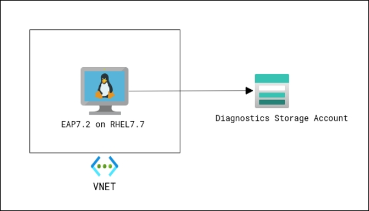
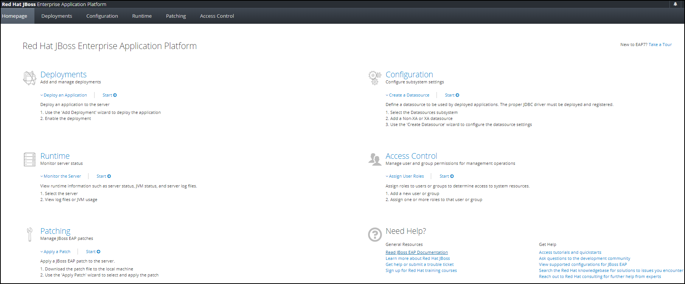

# Red Hat - JBoss EAP 7.2 on RHEL 7.7 VM (standalone mode)

`Tags: JBoss, Red Hat, EAP 7.2, RHEL 7.7, Azure, Azure VM, JavaEE`

<!-- TOC -->

1. [Solution Overview](#solution-overview)
2. [Template Solution Architecture](#template-solution-architecture)
3. [Licenses, Subscriptions and Costs](#licenses-subscriptions-and-costs)
4. [Prerequisites](#prerequisites)
5. [Deployment Steps](#deployment-steps)
6. [Deployment Time](#deployment-time)
7. [Validation Steps](#validation-steps)
8. [Notes](#notes)
9. [Support](#support)

<!-- /TOC -->

## Solution Overview

JBoss EAP (Enterprise Application Platform) is an open source platform for highly transactional, web-scale Java applications. EAP combines the familiar and popular Jakarta EE specifications with the latest technologies, like Microprofile, to modernize your applications from traditional Java EE into the new world of DevOps, cloud, containers, and microservices. EAP includes everything needed to build, run, deploy, and manage enterprise Java applications in a variety of environments, including on-premise, virtual environments, and in private, public, and hybrid clouds.

Red Hat Subscription Management (RHSM) is a customer-driven, end-to-end solution that provides tools for subscription status and management and integrates with Red Hat's system management tools. To obtain an rhsm account for JBoss EAP, go to: www.redhat.com.

This Azure quickstart template deploys a web application named dukes on JBoss EAP 7.2 running on RHEL 7.7 VM.

## Template Solution Architecture
This template creates all the Azure compute resources to run JBoss EAP 7.2 on top of RHEL 7.7 VM. The following resources are created by this template:

- RHEL 7.7 VM 
- Public IP 
- Virtual Network 
- Network Security Group 
- JBoss EAP 7.2
- Sample application named dukes deployed on JBoss EAP 7.2

Following is the Architecture:

To learn more about JBoss Enterprise Application Platform, visit:
https://access.redhat.com/documentation/en-us/red_hat_jboss_enterprise_application_platform/7.2/

## Licenses, Subscriptions and Costs

The RHEL 7.7 is Pay-As-You-Go image which carries a separate hourly charge that is in addition to Microsoft's Linux VM rates. Total price of the VM consists of the base Linux VM price plus RHEL VM image surcharge. See [Red Hat Enterprise Linux pricing](https://azure.microsoft.com/en-us/pricing/details/virtual-machines/red-hat/) for details. You also need to have a Red Hat account to register to Red Hat Subscription Manager (RHSM) and install JBoss EAP. Click [here](https://access.redhat.com/products/red-hat-subscription-management) to know more about RHSM and pricing.

## Prerequisites

1. Azure Subscription with the specified payment method (RHEL 7.7 is an [Azure Marketplace](https://azuremarketplace.microsoft.com/en-us/marketplace/apps/RedHat.RedHatEnterpriseLinux77-ARM?tab=Overview) product and requires the payment method to be specified in Azure Subscription)

2. To deploy the template, you will need to:

   - Choose an admin username and password/ssh key for your VM.
    
   - Choose DNS Label Prefix for the public IP which should be unique. Note that this will also be the name of your VM.

   - Choose JBoss EAP username and password to enable the JBoss EAP manager UI and deployment method.
    
   - Provide your RHSM username and password

## Deployment Steps

Build your environment with JBoss EAP 7.2 on top of RHEL 7.7 on Azure by clicking the Deploy to Azure button and fill in the following parameter values:

   - **Subscription** - Choose the appropriate subscription where you would like to deploy.

   - **Resource Group** - Create a new Resource Group or you can select an existing one.

   - **Location** - Choose the appropriate location for your deployment.

   - **Admin Username** - User account name for logging into your RHEL VM.

   - **DNS Label Prefix** - DNS Label for the Public IP and this is also the name of your VM. Must be lowercase. It should match with the following regular expression: ^[a-z][a-z0-9-]{1,61}[a-z0-9]$ or it will raise an error.
   
   - **Authentication Type** - Type of authentication to use on the Virtual Machine.

   - **Admin Password or Key** - User account password/ssh key for logging into your RHEL VM.

   - **JBoss EAP Username** - Username for JBoss EAP Console.

   - **JBoss EAP Password** - User account password for JBoss EAP Console.
    
   - **RHSM Username** - Username for the Red Hat account.

   - **RHSM Password** - User account password for the Red Hat account.

   - **RHSM Pool ID** - Red Hat Subscription Manager Pool ID.

   - **VM Size** - Choose the appropriate size of the VM from the dropdown options.

   - Leave the rest of the parameter values as it is and accept the terms and conditions before clicking on Purchase.
    
## Deployment Time 

The deployment takes less than 10 minutes to complete.

## Validation Steps

- Once the deployment is successful, go to the VM details and copy the DNS Name of the VM.
- Open a web browser and go to http://<PUBLIC_HOSTNAME>:8080/dukes/ and you should see the application running.

  

- To access the administration console go to http://<PUBLIC_HOSTNAME>:8080 and click on the link Administration Console and enter the JBoss EAP username and password to see the console.

  

## Notes

If you don't have a Red Hat subscription to install a JBoss EAP, you can go through WildFly instead of JBoss EAP:

*  <a href="https://github.com/SpektraSystems/redhat-mw-cloud-quickstart/tree/master/wildfly-standalone-centos8" target="_blank"> [Red Hat WildFly 18.0.1.Final on CentOS 8]</a> - Standalone WildFly 18 with a sample web app on a CentOs 8 Azure VM.

## Support 

For any support related questions, issues or customization requirements, please contact info@spektrasystems.com

