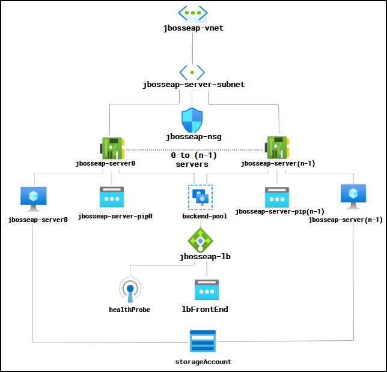
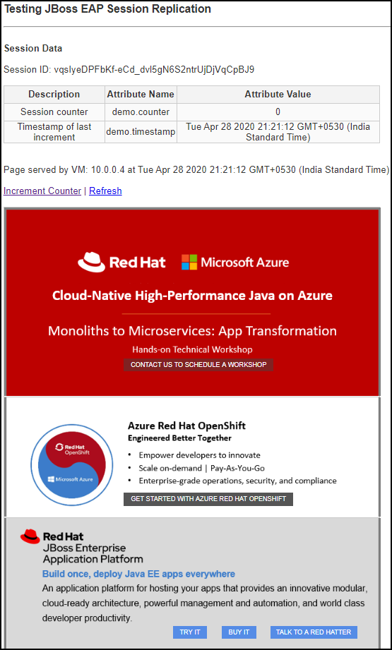
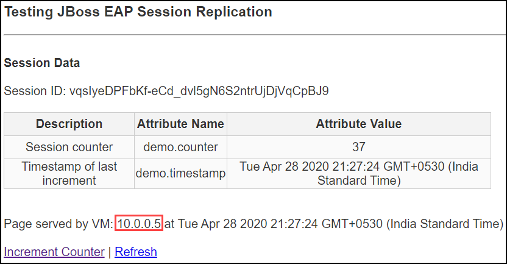

# JBoss EAP 7.3 on RHEL 8.0 (clustered, multi-VM)

`Tags: JBoss, Red Hat, EAP 7.3, Cluster, Load Balancer, RHEL 8.0, Azure, Azure VM, Java EE`

<!-- TOC -->

1. [Solution Overview](#solution-overview)
2. [Template Solution Architecture](#template-solution-architecture)
3. [Subscriptions and Costs](#subscriptions-and-costs)
4. [Prerequisites](#prerequisites)
5. [Deployment Steps](#deployment-steps)
6. [Deployment Time](#deployment-time)
7. [Validation Steps](#validation-steps)
8. [Troubleshooting](#troubleshooting)
9. [Support](#support)

<!-- /TOC -->

## Solution Overview

JBoss EAP (Enterprise Application Platform) is an open source platform for highly transactional, web-scale Java applications. EAP combines the familiar and popular Jakarta EE specifications with the latest technologies, like Microprofile, to modernize your applications from traditional Java EE into the new world of DevOps, cloud, containers, and microservices. EAP includes everything needed to build, run, deploy, and manage enterprise Java applications in a variety of environments, including on-premises, virtual environments, and in private, public, and hybrid clouds.

Red Hat Subscription Management (RHSM) is a customer-driven, end-to-end solution that provides tools for subscription status and management and integrates with Red Hat's system management tools. To obtain an RHSM account for JBoss EAP, go to: www.redhat.com.

## Template Solution Architecture

This Azure Resource Manager (ARM) template creates all the Azure compute resources to run JBoss EAP 7.3 cluster running 'n' number of RHEL 8.0 VMs where 'n' is decided by the user and all the VMs are added to the backend pool of a Load Balancer. The following resources are created by this template:

- RHEL 8.0 Virtual Machines
- 1 Load Balancer
- Public IPs for Load Balancer and VMs
- Virtual Network with a single subnet
- JBoss EAP 7.3 cluster setup on the RHEL VMs
- Sample Java application called **eap-session-replication** deployed on JBoss EAP 7.3
- Network Security Group
- Storage Account

Following is the Architecture:

To learn more about the JBoss Enterprise Application Platform, visit:

https://access.redhat.com/documentation/en-us/red_hat_jboss_enterprise_application_platform/7.3/

## Subscriptions and Costs

This quickstart is designed to give multiple choice in terms of RHEL OS licensing. 

- Red Hat Enterprise Linux OS as PAYG (Pay-As-You-Go) or BYOS (Bring-Your-Own-Subscription).
- Red Hat JBoss Enterprise Application Platform (EAP) is available through BYOS (Bring-Your-Own-Subscription) only.

#### Using RHEL OS with PAYG Model

By default this template uses the On-Demand Red Hat Enterprise Linux 8.0 Pay-As-You-Go (PAYG) image from the Azure Gallery. When using this On-Demand image, there is an additional hourly RHEL subscription charge for using this image on top of the normal compute, network and storage costs. At the same time, the instance will be registered to your Red Hat subscription, so you will also be using one of your entitlements. This will lead to "double billing". To avoid this, you would need to build your own RHEL image, which is defined in this [Red Hat KB article](https://access.redhat.com/articles/uploading-rhel-image-to-azure).

Check [Red Hat Enterprise Linux pricing](https://azure.microsoft.com/en-us/pricing/details/virtual-machines/red-hat/) for details on the RHEL VMs pricing for PAYG model. In order to use RHEL in PAYG model, you will need an Azure Subscription with the specified payment method (RHEL 8.0 is an [Azure Marketplace](https://azuremarketplace.microsoft.com/en-us/marketplace/apps/RedHat.RedHatEnterpriseLinux80-ARM?tab=Overview) product and requires a payment method to be specified in the Azure Subscription). 

#### Using RHEL OS with BYOS Model

In order to use BYOS for RHEL OS Licensing, you need to have a valid Red Hat subscription with entitlements to use RHEL OS in Azure. Please complete the following prerequisites in order to use RHEL OS through BYOS model before you deploy this quickstart template.

1. Ensure you have RHEL OS and JBoss EAP entitlements attached to your Red Hat Subscription.
2. Authorize your Azure Subscription ID to use RHEL BYOS images. Please follow [Red Hat Subscription Management documentation](https://access.redhat.com/documentation/en-us/red_hat_subscription_management/1/html/red_hat_cloud_access_reference_guide/con-enable-subs) to complete this process. This includes multiple steps including:

    2.1 Enable Microsoft Azure as provider in your Red Hat Cloud Access Dashboard.

    2.2 Add your Azure Subscription IDs.

    2.3 Enable new products for Cloud Access on Microsoft Azure.
    
    2.4 Activate Red Hat Gold Images for your Azure Subscription. Refer to [Red Hat Subscription Management](https://access.redhat.com/documentation/en-us/red_hat_subscription_management/1/html/red_hat_cloud_access_reference_guide/using_red_hat_gold_images#con-gold-image-azure) for more details.

    2.5 Wait for Red Hat Gold Images to be available in your Azure subscription. These are typically available within 3 hours.
    
3. Accept the Marketplace Terms and Conditions in Azure for the RHEL BYOS Images. You can complete this by running Azure CLI commands, as given below. Refer to [Red Hat Enterprise Linux BYOS Gold Images in Azure documentation](https://docs.microsoft.com/en-us/azure/virtual-machines/workloads/redhat/byos) for more details on this.

    3.1 Launch an Azure CLI session and authenticate with your Azure account. Refer to [Signing in with Azure CLI](https://docs.microsoft.com/en-us/cli/azure/authenticate-azure-cli?view=azure-cli-latest) for assistance.

    3.2 Verify the RHEL BYOS images are available in your subscription by running the following CLI command. If you don't get any results here, please refer to #2 and ensure that your Azure subscription is activated for RHEL BYOS images.

    `az vm image list --offer rhel-byos --all`

    3.3 Run the following command to accept the Marketplace Terms for RHEL 8.0 BYOS.

    `az vm image terms accept --publisher redhat --offer rhel-byos --plan rhel-lvm8`

4. Your subscription is now ready to deploy RHEL 8.0 BYOS virtual machines.

#### Using JBoss EAP with BYOS Model

JBoss EAP is available on Azure through BYOS model only; you need to supply your RHSM credentials along with RHSM pool id having valid EAP entitlements when deploying this template. If you don't have EAP entitlement, obtain a [JBoss EAP evaluation subscription](https://access.redhat.com/products/red-hat-jboss-enterprise-application-platform/evaluation) before you get started.
No additional steps are required for this.

## Prerequisites

1. Azure Subscription compliant with licensing requirements specified in 'Subscriptions and Costs' section.

2. To deploy the template, you will need:

    - **Admin Username** and password/ssh key data which is an SSH RSA public key for your VM. 

    - **JBoss EAP Username** and password

    - **RHSM Username** and password

    - **RHSM Pool ID for EAP and/or RHEL OS**
    
## Deployment Steps

Build your environment with JBoss EAP 7.3 cluster setup on 'n' number of RHEL 8.0 VMs where 'n' is decided by the user and all the VMs are added to the backend pool of a Load Balancer on Azure in a few simple steps:  
1. Launch the template by clicking the **Deploy to Azure** button.  
2. Complete the following parameter values and accept the Terms and Conditions before clicking on the **Purchase** button.

    - **Subscription** - Choose the appropriate subscription for deployment.

    - **Resource Group** - Create a new Resource Group or select an existing one.

    - **Location** - Choose the appropriate location for deployment.

    - **Admin Username** - User account name for logging into the RHEL VM.
    
    - **Authentication Type** - Type of authentication to use on the Virtual Machine.

    - **Admin Password or SSH Key** - User account password/ssh key data which is an SSH RSA public key for logging into the RHEL VM.

    - **JBoss EAP Username** - Username for JBoss EAP Console.

    - **JBoss EAP Password** - User account password for JBoss EAP Console.

    - **RHEL OS License Type** - Choose the type of RHEL OS License from the dropdown options for deploying the Virtual Machine. You will have either the option of PAYG by default or BYOS.

    - **RHSM Username** - Username for the Red Hat account.

    - **RHSM Password** - User account password for the Red Hat account.
   
    - **RHSM Pool ID for EAP** - Red Hat Subscription Manager Pool ID (Should have EAP entitlement)

    - **RHSM Pool ID for RHEL OS** - Red Hat Subscription Manager Pool ID (Should have RHEL entitlement). This is mandatory when selecting BYOS RHEL OS as License Type.  This should be left blank when selecting RHEL OS License Type PAYG.

    - **Storage Replication** - Choose the [Replication Strategy](https://docs.microsoft.com/en-us/azure/storage/common/storage-redundancy) for your Storage account.

    - **VM Size** - Choose the appropriate size of the VM from the dropdown options.

    - **Number of Instances** - Number of VMs to be deployed.

    - Leave the rest of the parameter values (artifacts and Location) as is, accept the Terms and Conditions, and proceed to purchase.
    
## Deployment Time 

The deployment takes approximately 10 minutes to complete.

## Validation Steps

- Once the deployment is successful, go to the outputs section of the deployment to obtain the App URL.

  

- To obtain the Public IP of a VM, go to the VM details page. Under settings section go to Networking and copy the NIC Public IP. Open a web browser and go to **http://<PUBLIC_IP_Address>:8080** and you should see the web page as follows. Use the same Public IP to Login to the VM.

  

- To access the administration console, click on the **Administration Console** shown in the above image and enter JBoss EAP Username and password to access the console of the respective VM.

  

- To access the LB App UI console, enter the App URL that you copied from the output page and paste it in a browser. The web application displays the *Session ID*, *Session counter* and *Timestamp* (these are variables stored in the session that are replicated) and the container Private IP address that the web page and session is being hosted from. Clicking on the Increment Counter updates the session counter and clicking on Refresh will refresh the page.

  
  
  

- Note that in the EAP Session Replication page of Load Balancer, the private IP displayed is that of one of the VMs. If you click on Increment Counter/Refresh button when you stop VM, restart VM or if the service the VM corresponding to the Private IP displayed is down, the private IP displayed will change to that of another VM but the Session ID remains the same which shows that the Session got replicated.

  

## Troubleshooting

This section includes common errors faced during deployments and details on how you can troubleshoot these errors. 

#### Azure Platform 

- If the parameter criteria are not fulfilled (ex.- the Admin Password criteria) or if any mandatory parameters are not provided in the parameters section then the deployment will not start. Also the Terms & Conditions mentioned must be accepted before clicking on Purchase.

- Once the deployment starts the resources being deployed will be visible on the deployment page and in the case of any deployment failure a more detailed failure message is available. 

- If your deployment fails at the **VM Custom Script Extension** resource, please refer to the next section for further troubleshooting.

#### Troubleshooting EAP deployment extension

This quickstart template uses VM Custom Script Extension to deploy and configure JBoss EAP and configure the sample application. Your deployment can fail at this stage due to several reasons such as:

- Invalid Red Hat Subscription credentials or EAP entitlement
- Invalid EAP/RHEL OS entitlement Pool ID

Follow the below steps to troubleshoot this further

1. Login to the provisioned virtual machine through SSH. You can retrieve the Public IP of the VM using the Azure portal VM overview page. Under settings section go to Networking and copy the NIC Public IP.

2. Switch to root user

    `sudo su -`

3. Enter your VM Admin Password if prompted.

4. Change directory to logging directory

    `cd /var/lib/waagent/custom-script/download/0`

5. Review the logs in jbosseap.install.log log file. 

    `more jbosseap.install.log`

This log file will have details that include deployment failure reason and possible solutions. If your deployment failed due to RHSM account or entitlements, please refer to 'Subscriptions and Costs' section to complete the prerequisites and try again. Also note after your Azure subscription receives access to Red Hat Gold Images, you can locate them in the Azure portal. Go to **Create a Resource** > **See all**. At the top of the page, you'll see that you have private offers.

Select the purple link, to view your private offers.

Please refer to [Using the Azure Custom Script Extension Version 2 with Linux VMs](https://docs.microsoft.com/en-us/azure/virtual-machines/extensions/custom-script-linux) for more details on troubleshooting VM custom script extensions.

## Support

For any support related questions, issues or customization requirements, please contact info@spektrasystems.com
